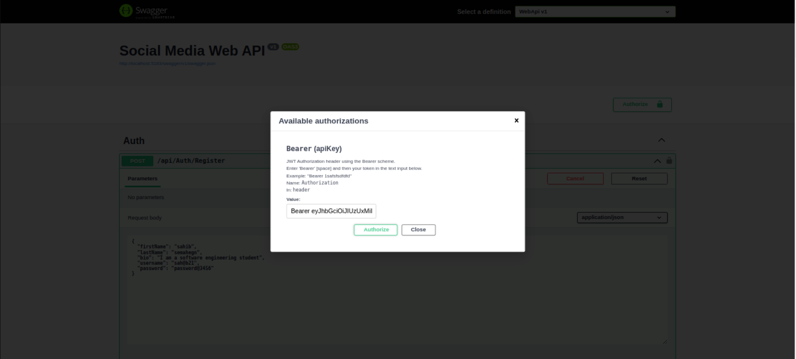
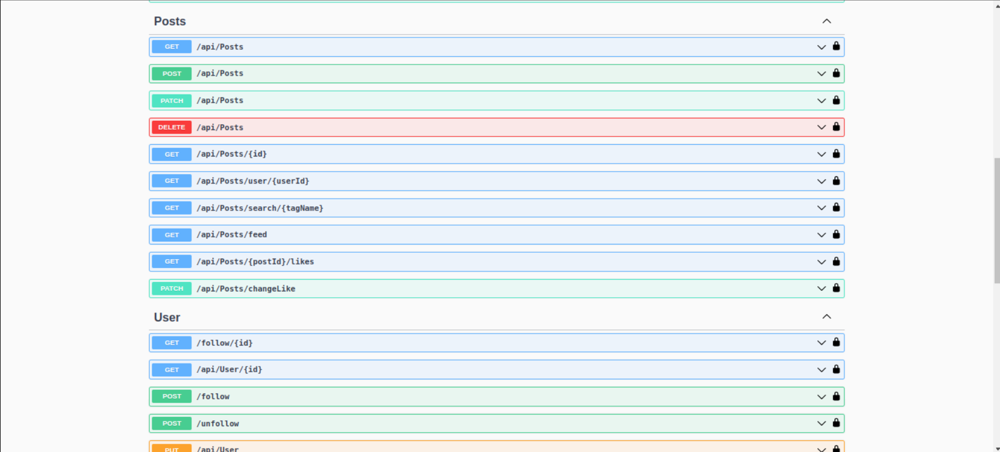

# Social Media Web API

A RESTful social-media backend built on **Clean Architecture** and **CQRS**, with JWT authentication, a full posts/comments/reactions/follow feature set, Swagger/OpenAPI docs, and a complete unit-test suite.



## Features

- **Auth** — registration and login issuing **JWT Bearer** tokens.
- **Posts** — create, update, delete, get by id, **personalized feed**, search by tag, and likes.
- **Comments & reactions** — comment on posts and react (like/dislike) to posts and comments.
- **Social graph** — follow / unfollow users.
- **Notifications** — generated on relevant social events.



## Architecture

Layered Clean Architecture with CQRS — each use case is a Command/Query with its own handler:

```
Domain/         entities and core rules
Application/    Features → Handlers → Commands & Queries (CQRS), DTOs, validation
Persistence/    EF repositories + Unit of Work
WebApi/         controllers, JWT middleware, Swagger
Application.Tests/  unit tests with mock repositories for every feature
```

## Tech stack

**ASP.NET Core** · **C#** · Entity Framework (repository + Unit of Work) · **JWT** · **Swagger / OpenAPI** · xUnit

## Running locally

```bash
dotnet restore
dotnet build
dotnet run --project group-1A/WebApi
```

Open the Swagger UI at the URL printed on startup to explore and authorize requests.

> Built as a team (A2SV cohort) project, applying Clean Architecture, CQRS, and test-first development.
